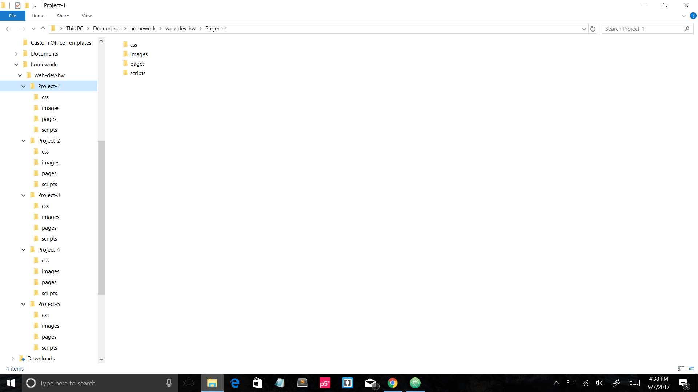

# My First README.md

# *Toby Long*
Had some trouble figuring out why my horizontal rules weren't working then found out I needed to switch to Github preview.  A lot of what I've seen this week was review from previous classes, but I had forgot a lot of that information.  I think after a few weeks things will go much more smoothly.

---

**To do:**
1. Install Github desktop app.
2. Practice a lot of coding.

**Other stuff to do:**

* Make an unordered list
* Be less stupid at coding.  That took to long to figure out :(

```
I don't think I have ever used the backtick key on a computer
```
[Click here ](https://www.google.com)

Screenshot:


