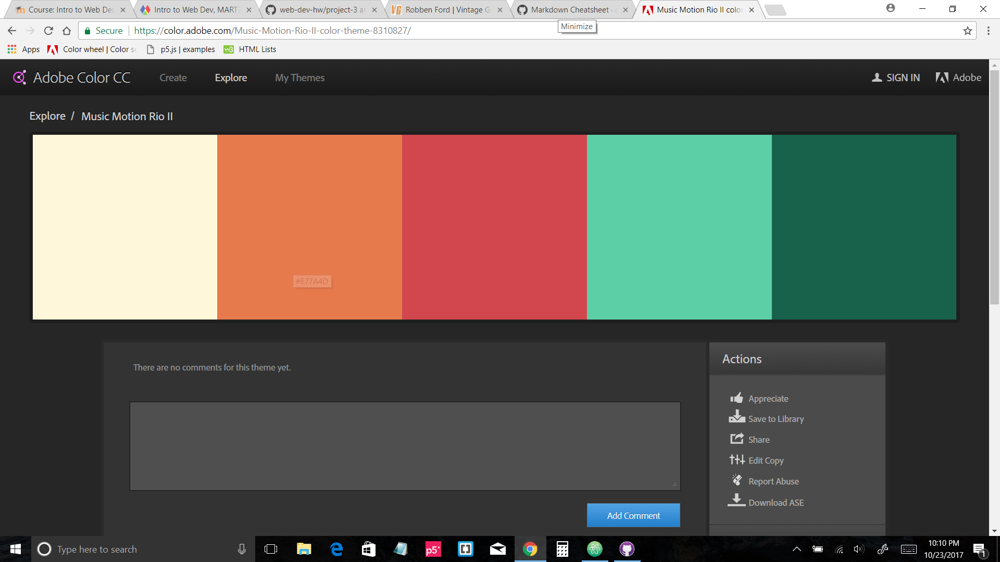

# Project 3 README.md

# *Toby Long*

---

1. I'd like to do an article from a website.
2. I think I'll do it on my favorite guitar player Robben Ford's gear. There's a website called *Vintage Guitar*. [Here](http://www.vintageguitar.com/3401/robben-ford/) is a link to the article I'm thinking of.
3. The authors name is Dan Forte, who has written many articles for the magazine. I'll likely reference other articles he has written to give people a sense of the kind of music he likes to write about.
4. Here is a screenshot of a color palette I might use. I'm a little color blind, so I just went to the adobe color site and typed in "music." Looks like the feel I'm going for. Some of his guitars are close to those colors.

